# CAPÍTULO II: MARCO TEÓRICO

El presente capítulo describe las herramientas, tecnologías y conceptos utilizados en el desarrollo del sistema de Checklist Vehicular para Logística Red Aduanera. Cada sección incluye la definición teórica, las características técnicas y la aplicación específica en el proyecto.

---

## 2.1 Fundamentos del Desarrollo de Software

### 2.1.1 Ciclo de Vida del Software

El ciclo de vida del software (SDLC - Software Development Life Cycle) es un proceso estructurado que comprende las fases de planificación, análisis, diseño, implementación, pruebas, despliegue y mantenimiento de un sistema informático (Pressman, 2019). Este ciclo permite garantizar que el desarrollo de software siga una metodología sistemática y controlada.

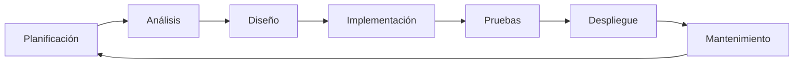

**Fases del Ciclo de Vida:**

| Fase | Descripción | Entregable |
|------|-------------|------------|
| Planificación | Definición del proyecto y viabilidad | Documento de visión |
| Análisis | Recolección de requerimientos | Especificación de requisitos |
| Diseño | Arquitectura y modelado | Diagramas UML |
| Implementación | Codificación del sistema | Código fuente |
| Pruebas | Validación del sistema | Reporte de pruebas |
| Despliegue | Instalación en producción | Sistema operativo |
| Mantenimiento | Actualizaciones correctivas | Parches y versiones |

**Aplicación en el proyecto**: El desarrollo del sistema de Checklist Vehicular siguió el ciclo de vida clásico, adaptando cada fase a la metodología Scrum para permitir iteraciones cortas y entrega incremental de funcionalidad.

---

### 2.1.2 Metodologías Ágiles

Las metodologías ágiles son enfoques de desarrollo de software que priorizan la flexibilidad, colaboración y entrega iterativa de valor (Beck et al., 2001). Scrum, XP (Extreme Programming) y Kanban son las metodologías ágiles más utilizadas actualmente.

#### 2.1.2.1 Scrum

Scrum es un marco de trabajo ágil que facilita el desarrollo iterativo e incremental de software. Según Schwaber y Sutherland (2020), Scrum emplea sprints (iteraciones de 2 a 4 semanas) para entregar incrementos de producto funcional.

**Roles en Scrum:**

| Rol | Responsabilidad |
|-----|-----------------|
| Product Owner | Maximizar el valor del producto, gestionar el backlog |
| Scrum Master | Facilitar el proceso, eliminar obstáculos |
| Development Team | Auto-organizado, multidisciplinario, entrega valor |

**Eventos en Scrum:**

| Evento | Duración | Propósito |
|--------|----------|-----------|
| Sprint Planning | 8 horas | Definir qué hacer en el sprint |
| Daily Scrum | 15 minutos | Sincronizar trabajo diario |
| Sprint Review | 4 horas | Demostrar incremento completado |
| Sprint Retrospective | 3 horas | Identificar mejoras |

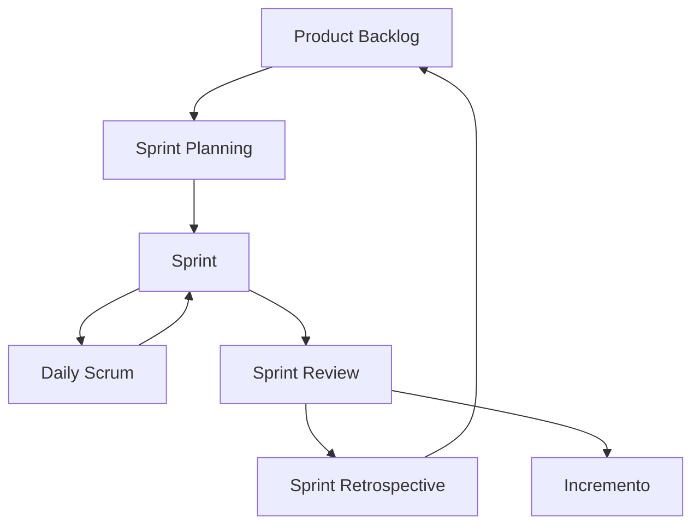

**Aplicación en el proyecto**: El equipo desarrolló el sistema en sprints de 2 semanas, con planning los lunes, dailies diarios de 15 minutos, review los viernes y retrospective cada 2 sprints.

---

## 2.2 Lenguajes de Programación

### 2.2.1 Python

Python es un lenguaje de programación de alto nivel, interpretado y de propósito general, creado por Guido van Rossum (2008). Se caracteriza por su sintaxis clara y legible, tipado dinámico y soporte para múltiples paradigmas de programación (funcional, orientada a objetos, imperativa).

**Características de Python:**

```python
# Ejemplo de sintaxis Python - Hola Mundo
def saludar(nombre):
    """Función que retorna un saludo personalizado."""
    return f"Hola, {nombre}! Bienvenido al sistema."

# Variables y tipos
mensaje = saludar("Guardia")
contador = 0
es_activo = True

# List comprehension
numeros = [1, 2, 3, 4, 5]
cuadrados = [n ** 2 for n in numeros if n % 2 == 0]
```

| Característica | Descripción |
|----------------|-------------|
| Interpretado | Ejecución línea por línea sin compilación |
| Tipado dinámico | Variables asignan tipo automáticamente |
| Biblioteca estándar | Módulos integrados para múltiples tareas |
| Multiplataforma | Funciona en Windows, Linux, macOS |
| Comunidad activa | Paquetes en PyPI disponibles |

**Aplicación en el proyecto**: Python se utilizó como lenguaje principal del backend con el framework Django 4.2, aprovechando su sintaxis legible y productividad para el desarrollo rápido de APIs REST.

---

### 2.2.2 TypeScript

TypeScript es un lenguaje de programación desarrollado por Microsoft que extiende JavaScript añadiendo tipado estático opcional y características orientadas a objetos (TypeScript, 2021).

```typescript
// Ejemplo de interfaces TypeScript
interface Vehiculo {
  id: number;
  placa: string;
  marca: string;
  modelo: string;
  enInstalacion: boolean;
}

interface Conductor {
  id: number;
  nombreCompleto: string;
  numeroLicencia: string;
  activo: boolean;
  vehiculo?: Vehiculo;
}

// Tipo unión
type TipoEntidad = 'tracto' | 'conductor' | 'empleado' | 'visitante';

// Función con tipos
function registrarAcceso(
  vehiculo: Vehiculo,
  conductor: Conductor,
  tipo: TipoEntidad
): boolean {
  return vehiculo.enInstalacion === false && conductor.activo;
}
```

**Ventajas sobre JavaScript:**

| Ventaja | Descripción |
|---------|-------------|
| Tipado estático opcional | Detecta errores en tiempo de compilación |
| Autocompletado inteligente | Mejora productividad en IDEs |
| Refactorización segura | Cambios sin romper código |
| Interfaces y tipos | Estructuras de datos bien definidas |

**Aplicación en el proyecto**: TypeScript se utilizó en el desarrollo de la aplicación móvil con Ionic/Angular 17, aprovechando su tipado para reducir errores y mejorar el mantenimiento del código.

---

### 2.2.3 JavaScript y JSON

JavaScript es un lenguaje de programación interpretado, orientado a eventos, utilizado para desarrollo web del lado del cliente (Flanagan, 2020). JSON (JavaScript Object Notation) es un formato ligero para intercambio de datos (ECMA International, 2017).

```javascript
// Ejemplo de JSON - Registro de Acceso
{
  "id": 123,
  "tipo_movimiento": "entrada",
  "tipo_entidad": "tracto",
  "vehiculo": {
    "id": 45,
    "placa": "TRA-001",
    "marca": "Kenworth",
    "modelo": "T680"
  },
  "conductor": {
    "id": 78,
    "nombre_completo": "Juan Pérez",
    "numero_licencia": "DL-123456"
  },
  "turno": {
    "id": 1,
    "guardia_id": 5
  },
  "fecha_hora": "2024-01-15T08:30:00Z",
  "conductor_pendiente_salida": true,
  "observaciones": "Sin novedad"
}
```

**Aplicación en el proyecto**: JavaScript se utilizó en el frontend React junto con JSON para el intercambio de datos con la API REST, utilizando la sintaxis moderna ES6+ para componentes funcionales con hooks.

---

## 2.3 Tecnologías del Backend

### 2.3.1 Django Framework

Django es un framework web de alto nivel escrito en Python que encourage el desarrollo rápido y el diseño limpio y pragmático (Django Software Foundation, 2024).

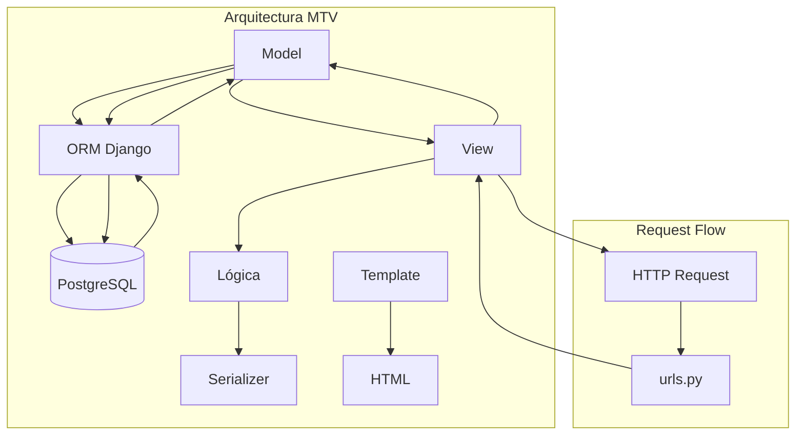

**Características Principales:**

| Característica | Descripción |
|----------------|-------------|
| ORM potente | Interactúa con BD usando objetos Python |
| Admin automático | Interfaz de administración lista |
| Sistema de templating | Plantillas HTML dinámicas |
| Seguridad integrada | Protección contra SQL injection, XSS, CSRF |
| URL routing | Sistema de rutas flexible |

**Aplicación en el proyecto**: Django se utilizó como framework principal del backend, aprovechando su ORM para definir los modelos de datos (Turno, RegistroAcceso, Vehiculo, Conductor, Empleado, Visitante, Checklist) y su sistema de administración para la gestión de datos.

---

### 2.3.2 Django REST Framework

Django REST Framework (DRF) es un kit de herramientas para construir APIs web en Django (Encode, 2024).

```python
# Ejemplo de Serializer
from rest_framework import serializers
from .models import Vehiculo, Conductor

class VehiculoSerializer(serializers.ModelSerializer):
    class Meta:
        model = Vehiculo
        fields = ['id', 'placa', 'marca', 'modelo', 'en_instalacion']

class ConductorSerializer(serializers.ModelSerializer):
    vehiculo = VehiculoSerializer(read_only=True)
    
    class Meta:
        model = Conductor
        fields = ['id', 'nombre_completo', 'numero_licencia', 'activo', 'vehiculo']

# Ejemplo de View
from rest_framework.views import APIView
from rest_framework.response import Response
from rest_framework import status

class ConductoresDisponiblesAPIView(APIView):
    def get(self, request):
        conductores = Conductor.objects.filter(activo=True)
        serializer = ConductorSerializer(conductores, many=True)
        return Response(serializer.data)
```

| Componente | Función |
|------------|---------|
| Serializers | Convierte modelos Django ↔ JSON |
| APIView | Clase base para crear endpoints |
| ViewSets | Operaciones CRUD automáticas |
| Authentication | JWT, Token, OAuth2 |
| Permissions | Control de acceso granular |

**Aplicación en el proyecto**: DRF se utilizó para crear la API REST del sistema, implementando views como `RegistroAccesoCreateAPIView`, `ConductoresDisponiblesAPIView` y `PendientesSalidaAPIView`.

---

### 2.3.3 API REST

Una API REST (Representational State Transfer) es un estilo arquitectónico para sistemas hipermedia distribuidos (Fielding, 2000). Las APIs REST utilizan los métodos HTTP estándar para realizar operaciones sobre recursos identificados por URLs.

**Métodos HTTP en REST:**

| Método | Operación | Ejemplo |
|--------|-----------|---------|
| GET | Leer recurso | GET /api/vehiculos/ |
| POST | Crear recurso | POST /api/registros/ |
| PUT | Actualizar recurso | PUT /api/checklist/5/ |
| DELETE | Eliminar recurso | DELETE /api/turno/3/ |
| PATCH | Actualización parcial | PATCH /api/user/1/ |

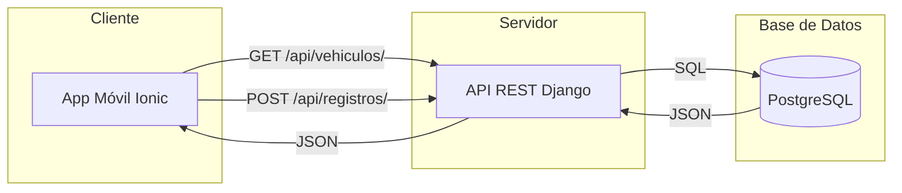

**Aplicación en el proyecto**: La comunicación entre la app móvil Ionic y el backend Django se realizó mediante endpoints REST que intercambian datos en formato JSON.

---

### 2.3.4 PostgreSQL

PostgreSQL es un sistema de gestión de bases de datos relacional de código abierto, conocido por su robustez y soporte de estándares SQL (PostgreSQL Global Development Group, 2024).

```sql
-- Ejemplo de tabla PostgreSQL
CREATE TABLE vehiculo (
    id SERIAL PRIMARY KEY,
    placa VARCHAR(20) UNIQUE NOT NULL,
    clave_interna VARCHAR(50),
    tipo_entidad VARCHAR(30) NOT NULL,
    marca VARCHAR(100),
    modelo VARCHAR(100),
    color VARCHAR(50),
    en_instalacion BOOLEAN DEFAULT FALSE,
    conductor_actual_id INTEGER REFERENCES conductor(id),
    ultimo_empleado_id INTEGER REFERENCES empleado(id),
    created_at TIMESTAMP DEFAULT CURRENT_TIMESTAMP,
    updated_at TIMESTAMP DEFAULT CURRENT_TIMESTAMP
);

CREATE INDEX idx_vehiculo_placa ON vehiculo(placa);
CREATE INDEX idx_vehiculo_en_instalacion ON vehiculo(en_instalacion) WHERE en_instalacion = TRUE;
```

**Características de PostgreSQL:**

| Característica | Descripción |
|----------------|-------------|
| ACID compliant | Transacciones atómicas, consistentes, aisladas, duraderas |
| Tipos avanzados | JSON, arrays, rangos, geométricos |
| Índices múltiples | B-tree, Hash, GiST, GIN |
| Procedimientos almacenados | Lógica de negocio en pl/pgSQL |
| BDR | Replicación lógica bidireccional |

**Aplicación en el proyecto**: PostgreSQL 15+ se utilizó como motor de base de datos, almacenando las tablas con relaciones e integridad referencial.

---

## 2.4 Tecnologías del Frontend

### 2.4.1 React

React es una biblioteca JavaScript para construir interfaces de usuario, desarrollada por Meta (React, 2024).

```jsx
// Ejemplo de componente React
import { useState, useEffect } from 'react';

function VehiculosPage() {
  const [vehiculos, setVehiculos] = useState([]);
  const [loading, setLoading] = useState(true);

  useEffect(() => {
    fetchVehiculos();
  }, []);

  const fetchVehiculos = async () => {
    try {
      const response = await api.get('/vehiculos/en-instalacion/');
      setVehiculos(response.data);
    } catch (error) {
      console.error('Error:', error);
    } finally {
      setLoading(false);
    }
  };

  return (
    <div className="vehiculos-container">
      <h1>Vehículos en Instalación</h1>
      {loading ? (
        <p>Cargando...</p>
      ) : (
        <ul>
          {vehiculos.map(v => (
            <li key={v.id}>{v.placa} - {v.marca}</li>
          ))}
        </ul>
      )}
    </div>
  );
}

export default VehiculosPage;
```

**Conceptos Fundamentales de React:**

| Concepto | Descripción |
|----------|-------------|
| Componentes | Bloques reutilizables que definen la interfaz |
| JSX | Sintaxis que permite escribir HTML en JavaScript |
| State | Datos internos que pueden cambiar |
| Props | Datos heredados del componente padre |
| Hooks | Funciones para usar estado en componentes funcionales |

**Aplicación en el proyecto**: React 18 se utilizó en el frontend web del sistema, implementando componentes funcionales con hooks para el dashboard, páginas de gestión y reportes.

---

### 2.4.2 Vite

Vite es una herramienta de construcción para proyectos JavaScript modernos, creada por Evan You (2024).

| Característica | Descripción |
|----------------|-------------|
| Inicio instantáneo | Carga módulos ES nativos directamente |
| HMR rápido | Actualiza sin refrescar toda la página |
| Build optimizado | Tree-shaking y code splitting |
| Configuración mínima | Funciona out-of-the-box |

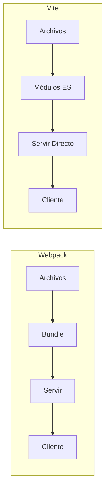

**Aplicación en el proyecto**: Vite 5 se utilizó como bundler y servidor de desarrollo para el frontend React, logrando tiempos de inicio de menos de 1 segundo.

---

### 2.4.3 Axios

Axios es una biblioteca JavaScript para realizar peticiones HTTP desde el navegador y Node.js (Axios, 2024).

```javascript
// Ejemplo de configuración Axios con interceptores
import axios from 'axios';

const api = axios.create({
  baseURL: 'http://localhost:8000/api',
  timeout: 10000,
  headers: {
    'Content-Type': 'application/json'
  }
});

// Interceptor para agregar token JWT
api.interceptors.request.use(
  (config) => {
    const token = localStorage.getItem('access_token');
    if (token) {
      config.headers.Authorization = `Bearer ${token}`;
    }
    return config;
  },
  (error) => Promise.reject(error)
);

// Interceptor para refresh token
api.interceptors.response.use(
  (response) => response,
  async (error) => {
    if (error.response?.status === 401) {
      // Intentar refresh token
    }
    return Promise.reject(error);
  }
);

export default api;
```

**Aplicación en el proyecto**: Axios se utilizó en la aplicación móvil Ionic para realizar peticiones HTTP al backend Django REST API, configurado con interceptores para incluir tokens JWT automáticamente.

---

### 2.4.4 Recharts y jsPDF

**Recharts** es una biblioteca de gráficos para React (Recharts, 2024).

```jsx
// Ejemplo de gráfico con Recharts
import { BarChart, Bar, XAxis, YAxis, CartesianGrid, Tooltip, Legend } from 'recharts';

function EstadisticasChart({ datos }) {
  return (
    <BarChart width={500} height={300} data={datos}>
      <CartesianGrid strokeDasharray="3 3" />
      <XAxis dataKey="fecha" />
      <YAxis />
      <Tooltip />
      <Legend />
      <Bar dataKey="entradas" fill="#82ca9d" />
      <Bar dataKey="salidas" fill="#8884d8" />
    </BarChart>
  );
}
```

**jsPDF** es una biblioteca JavaScript para generar PDFs (Parallax, 2024).

```javascript
// Ejemplo de generación de PDF con jsPDF
import jsPDF from 'jspdf';

function generarReporte(data) {
  const doc = new jsPDF();
  
  doc.setFontSize(18);
  doc.text('Reporte de Bitácora', 20, 20);
  
  doc.setFontSize(12);
  doc.text(`Fecha: ${data.fecha}`, 20, 30);
  doc.text(`Total entradas: ${data.entradas}`, 20, 40);
  doc.text(`Total salidas: ${data.salidas}`, 20, 50);
  
  // Agregar tabla
  doc.autoTable({
    head: [['Placa', 'Tipo', 'Hora']],
    body: data.registros
  });
  
  doc.save('reporte_bitacora.pdf');
}
```

**Aplicación en el proyecto**: Recharts se utilizó para visualizar estadísticas en el dashboard y jsPDF para generar reportes exportables en PDF.

---

## 2.5 Tecnologías Móviles

### 2.5.1 Ionic Framework

Ionic es un framework de código abierto para construir aplicaciones móviles híbridas multiplataforma (Ionic, 2024).

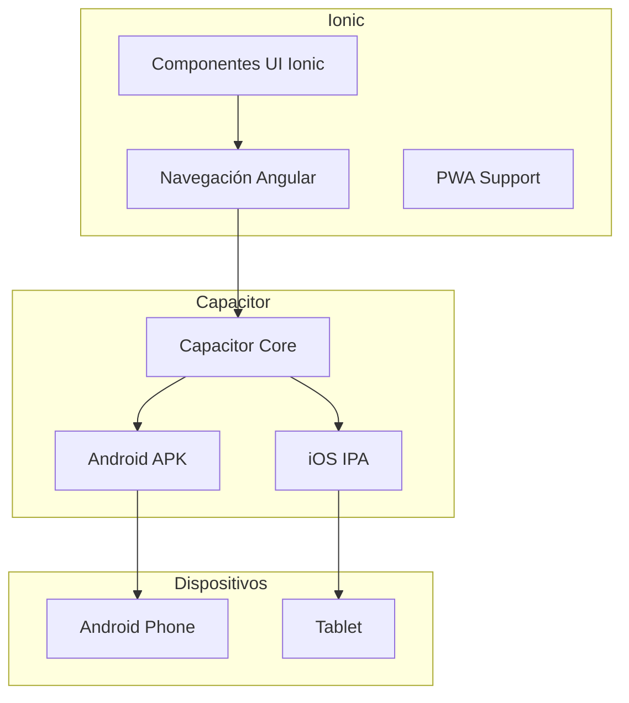

**Características de Ionic:**

| Característica | Descripción |
|----------------|-------------|
| Componentes UI | Biblioteca de componentes nativos iOS/Android |
| Navegación | Sistema de rutas basado en Angular Router |
| Animaciones | Motor de animaciones integrado |
| Plugins | Acceso a cámara, GPS, archivos mediante Capacitor |

**Aplicación en el proyecto**: Ionic 7 se utilizó como framework de la aplicación móvil, permitiendo desarrollar una app que funciona como APK en dispositivos Android.

---

### 2.5.2 Angular

Angular es un framework de desarrollo web mantenido por Google, utilizado como base para Ionic (Angular, 2024).

```typescript
// Ejemplo de servicio Angular
import { Injectable } from '@angular/core';
import { HttpClient } from '@angular/common/http';
import { Observable } from 'rxjs';

@Injectable({
  providedIn: 'root'
})
export class ApiService {
  private baseUrl = 'http://localhost:8000/api';

  constructor(private http: HttpClient) {}

  getConductores(): Observable<any[]> {
    return this.http.get<any[]>(`${this.baseUrl}/conductores/`);
  }

  registrarAcceso(data: any): Observable<any> {
    return this.http.post(`${this.baseUrl}/registros-acceso/crear/`, data);
  }

  getVehiculosEnInstalacion(): Observable<any[]> {
    return this.http.get<any[]>(`${this.baseUrl}/vehiculos/en-instalacion/`);
  }
}
```

**Aplicación en el proyecto**: Angular 17 se utilizó como base de Ionic, definiendo la estructura de componentes, servicios para comunicación con la API, y módulos para organizar la funcionalidad de la app móvil.

---

### 2.5.3 Capacitor

Capacitor es una capa de abstracción que permite convertir aplicaciones web en aplicaciones nativas (Capacitor, 2024).

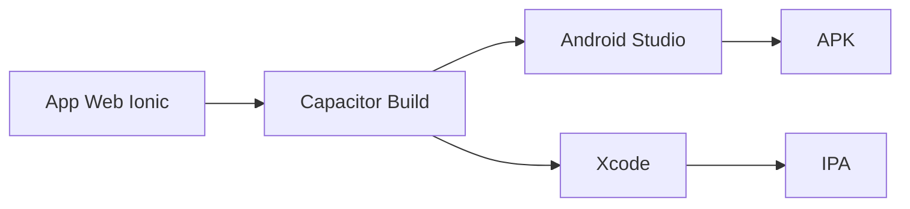

**Proceso de Build:**

1. Desarrollo web con Ionic/Angular
2. `npx cap add android` - Agregar plataforma Android
3. `npx cap sync` - Sincronizar con proyecto nativo
4. `npx cap open android` - Abrir en Android Studio
5. Build APK desde Android Studio

**Aplicación en el proyecto**: Capacitor 6 se utilizó para compilar la aplicación web Ionic en un APK instalable en dispositivos Android.

---

## 2.6 Seguridad de la Información

### 2.6.1 Autenticación con JWT

JSON Web Token (JWT) es un estándar abierto (RFC 7519) para transmitir información de forma segura (RFC 7519, 2015).

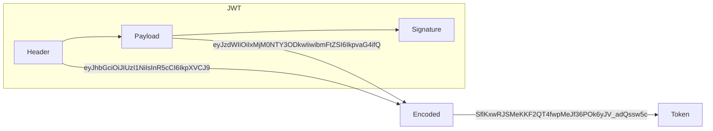

**Estructura de un JWT:**

| Parte | Descripción |
|-------|-------------|
| Header | Algoritmo (HS256) y tipo (JWT) |
| Payload | Claims: sub, exp, iat, role |
| Signature | HMAC-SHA256(Header + Payload, secret) |

```python
# Ejemplo de configuración JWT en Django
# settings.py
REST_FRAMEWORK = {
    'DEFAULT_AUTHENTICATION_CLASSES': (
        'rest_framework_simplejwt.authentication.JWTAuthentication',
    ),
    'DEFAULT_PERMISSION_CLASSES': (
        'rest_framework.permissions.IsAuthenticated',
    ),
}

SIMPLE_JWT = {
    'ACCESS_TOKEN_LIFETIME': timedelta(minutes=60),
    'REFRESH_TOKEN_LIFETIME': timedelta(days=1),
    'ROTATE_REFRESH_TOKENS': True,
    'AUTH_HEADER_TYPES': ('Bearer',),
}
```

**Flujo de autenticación JWT:**

1. Usuario envía credenciales → POST /api/token/
2. Servidor valida y retorna access_token + refresh_token
3. Cliente almacena tokens (localStorage o HttpOnly cookie)
4. Cliente incluye token → Authorization: Bearer <token>
5. Servidor valida firma y extrae información del usuario

**Aplicación en el proyecto**: Se implementó autenticación JWT para la API REST, donde cada petición de la app móvil incluye el token en el header `Authorization: Bearer <token>`.

---

### 2.6.2 Autenticación de Dos Factores (2FA)

La autenticación de dos factores (2FA) añade una capa adicional de seguridad requiriendo dos tipos de verificación: algo que el usuario conoce (contraseña) y algo que posee (dispositivo móvil).

**TOTP (Time-based One-Time Password):**

```python
# Ejemplo de generación TOTP con pyotp
import pyotp

# Generar secreto para un usuario
secret = pyotp.random_base32()
print(f"Secreto: {secret}")

# Generar URI para QR Code
totp = pyotp.TOTP(secret)
uri = totp.provisioning_uri(name="guardia@LRA.com", issuer_name="ChecklistLRA")
print(f"URI: {uri}")

# Verificar código ingreso
codigo = input("Ingrese código: ")
es_valido = totp.verify(codigo)
print(f"Válido: {es_valido}")
```

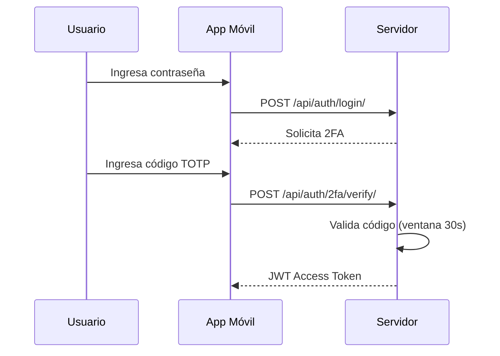

**Aplicación en el proyecto**: Se implementó 2FA con TOTP usando pyotp en Django, donde los guardias pueden vincular su cuenta con Google Authenticator.

---

### 2.6.3 Hash de Contraseñas

El hash de contraseñas es el proceso de aplicar una función criptográfica unidireccional (NIST, 2020).

**Comparativa de algoritmos:**

| Algoritmo | Iteraciones | Recomendación |
|-----------|-------------|---------------|
| MD5 | 1 | ❌ Obsoleto |
| SHA-1 | 1 | ❌ Obsoleto |
| SHA-256 | 1 | ⚠️ No óptimo para contraseñas |
| bcrypt | Cost factor 12 | ✅ Recomendado |
| PBKDF2 | 600,000 | ✅ Recomendado |
| Argon2 | Configurable | ✅ Mejor opción |

**Django hash de contraseñas:**

```
# Formato almacenado: algoritmo$salt$iteraciones$hash
# Ejemplo: pbkdf2_sha256$600000$salt$hash
```

**Aplicación en el proyecto**: Las contraseñas se almacenan utilizando PBKDF2-SHA256 de Django con 600,000 iteraciones.

---

### 2.6.4 OWASP Top 10

El OWASP Top 10 es un documento que enumera las vulnerabilidades más críticas en aplicaciones web (OWASP, 2021).

**Vulnerabilidades y contramedidas:**

| ID | Vulnerabilidad | Contramedida implementada |
|----|----------------|----------------------------|
| A01 | Broken Access Control | Permisos IsAuthenticated en todas las vistas |
| A02 | Cryptographic Failures | HTTPS obligatorio, TLS 1.2+ |
| A03 | Injection | ORM Django previene SQL injection |
| A04 | Insecure Design | Validación de entrada, sanitización |
| A05 | Security Misconfiguration | django-security middleware |
| A06 | Vulnerable Components | Dependabot, actualizaciones periódicas |
| A07 | Auth Failures | JWT + 2FA, rate limiting |
| A08 | Software Integrity | Validación de firmaware en APK |
| A09 | Logging Failures | Logging de auditoría en bitácora |
| A10 | SSRF | Validación de URLs, whitelist |

**Aplicación en el proyecto**: Se aplicaron contramedidas para cada categoría OWASP Top 10, incluyendo validación de entrada, parametrización de consultas y headers de seguridad.

---

### 2.6.5 HTTPS y Headers de Seguridad

HTTPS utiliza TLS (Transport Layer Security) para cifrar la comunicación entre cliente y servidor.

```python
# Configuración de security headers en Django
MIDDLEWARE = [
    'django.middleware.security.SecurityMiddleware',
    # ...
]

SECURE_CONTENT_TYPE_NOSNIFF = True
X_FRAME_OPTIONS = 'DENY'
SECURE_HSTS_SECONDS = 31536000
SECURE_HSTS_INCLUDE_SUBDOMAINS = True
SECURE_HSTS_PRELOAD = True
```

| Header | Función |
|--------|---------|
| Content-Security-Policy | Controla recursos cargados |
| X-Content-Type-Options | Previene MIME sniffing |
| X-Frame-Options | Previene clickjacking |
| Strict-Transport-Security | Fuerza HTTPS |
| Referrer-Policy | Controla información de referencia |

**Aplicación en el proyecto**: Se configuraron headers de seguridad en Django para proteger contra XSS, clickjacking y MIME sniffing.

---

### 2.6.6 DevSecOps

DevSecOps integra seguridad en cada fase del ciclo de desarrollo de software (OWASP, 2024).

**Herramientas utilizadas:**

| Herramienta | Tipo | Función |
|-------------|------|---------|
| Bandit | SAST | Análisis estático de código Python |
| OWASP ZAP | DAST | Pruebas dinámicas de seguridad |
| Dependabot | SCA | Escaneo de vulnerabilidades en dependencias |

```yaml
# Ejemplo de configuración Bandit
# .bandit
targets:
  - 'backend/**/*.py'
exclude:
  - '*/tests/*'
  - '*/migrations/*'
skips:
  - 'B413:blacklist'
```

**Aplicación en el proyecto**: Se utilizó Bandit para análisis estático del código Python, verificando que no existan vulnerabilidades como hardcoded credentials o funciones criptográficas inseguras.

---

## 2.7 Conceptos del Dominio

### 2.7.1 Control de Accesos Vehiculares

El control de accesos vehiculares es el proceso de gestionar y registrar la entrada y salida de vehículos en instalaciones restringidas.

**Flujo de entrada/salida:**

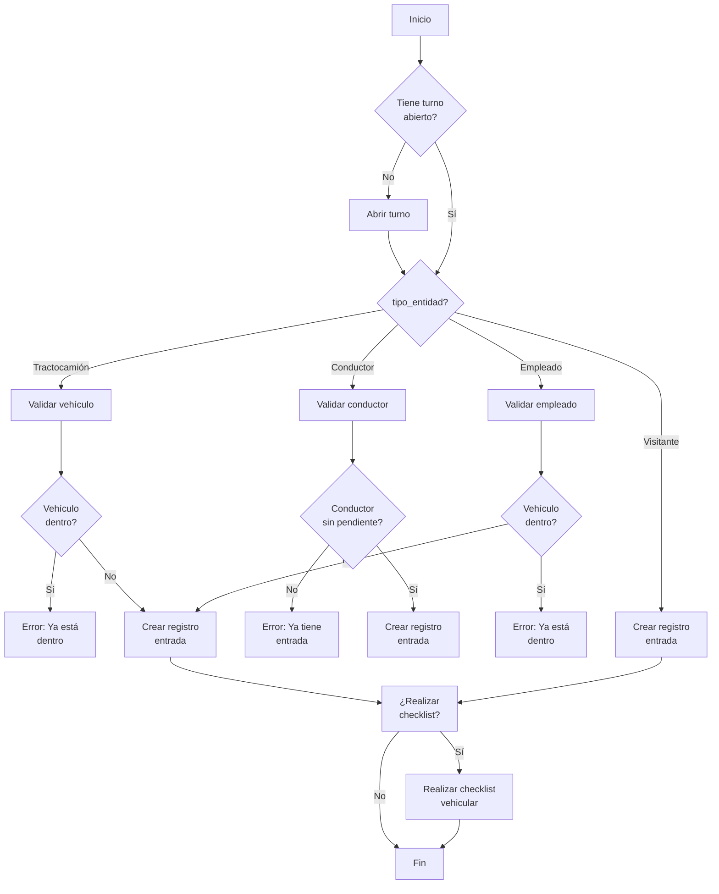

**Aplicación en el proyecto**: El sistema implementa el control de accesos vehiculares mediante registros de entrada y salida, checklists de inspección, y validación de estados.

---

### 2.7.2 Checklists de Inspección

Un checklist de inspección vehicular es un formulario estructurado que registra el estado de un vehículo.

**Elementos del checklist:**

| Elemento | Descripción |
|----------|-------------|
| Lluvia de golpes | Verificación visual de daños externos |
| Documentos vigentes | Licencia, seguro, tarjeta de circulación |
| Estado de neumáticos | Inspección visual de condición |
| Luces y direccionales | Funcionamiento correcto |
| Espejos | Limpios y sin daños |
| Evidencia fotográfica | Fotos del vehículo al momento |

```json
{
  "checklist": {
    "id": 1,
    "registro_acceso_id": 123,
    "resultados": {
      "lluvia_de_golpes": true,
      "documentos_vigentes": true,
      "estado_neumaticos": true,
      "luces_direccionales": true,
      "espejos": true
    },
    "observaciones": "Sin novedad",
    "evidencia_fotografica": "evidencias/2024/01/15/checklist_123.jpg",
    "fecha_creacion": "2024-01-15T08:35:00Z",
    "evaluador": {
      "id": 5,
      "username": "guardia_01"
    }
  }
}
```

**Aplicación en el proyecto**: Los guardias completan el checklist vehicular mediante la app móvil, capturando evidencia fotográfica y guardando los resultados en JSON.

---

### 2.7.3 Tipos de Entidad

El sistema maneja 5 tipos de entidades que acceden a las instalaciones:

| Tipo Entidad | Descripción | Validaciones |
|--------------|-------------|---------------|
| Tractocamión | Vehículos de carga pesada con remolque | Vehículo no dentro, conductor asignado |
| Conductor | Personal que opera tractocamiones | Sin entrada pendiente, activo |
| Empleado | Personal interno de empresas | Vehículo no dentro, empleado activo |
| Visitante | Personas externas por motivos específicos | Sin validaciones estrictas |
| Empleado Propio | Personal de LRA con vehículo propio | Sin entrada pendiente |

**Estados clave:**

- `en_instalacion`: Indica si el vehículo está dentro de las instalaciones
- `conductor_pendiente_salida`: Indica si el conductor no ha registrado salida
- `conductor_actual`: Referencia al conductor operando actualmente el vehículo

---

## 2.8 Resumen de Tecnologías Utilizadas

| Categoría | Tecnología | Versión |
|-----------|------------|---------|
| **Backend** | Python | 3.10+ |
| **Framework Web** | Django | 4.2+ |
| **API REST** | Django REST Framework | 3.14+ |
| **Base de Datos** | PostgreSQL | 15+ |
| **Frontend Web** | React | 18+ |
| **Bundler** | Vite | 5+ |
| **Peticiones HTTP** | Axios | 1.6+ |
| **Gráficos** | Recharts | 2.10+ |
| **Generación PDF** | jsPDF | 2.5+ |
| **Mobile Framework** | Ionic | 7+ |
| **Mobile Base** | Angular | 17+ |
| **Lenguaje Móvil** | TypeScript | 5+ |
| **Compilación Móvil** | Capacitor | 6+ |
| **Autenticación** | JWT (SimpleJWT) | - |
| **2FA** | pyotp (TOTP) | - |
| **Análisis Estático** | Bandit | - |

---

## 2.9 Arquitectura del Sistema

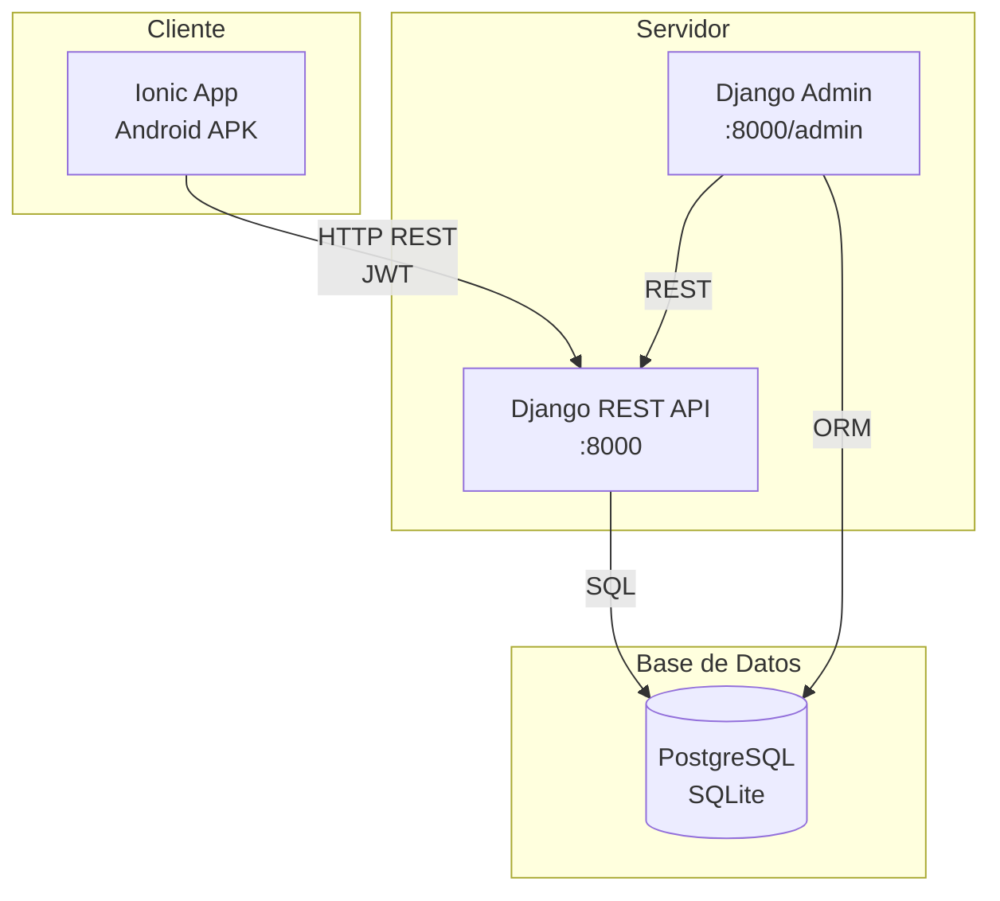

**Comunicación entre componentes:**

| Comunicación | Protocolo | Formato |
|--------------|-----------|---------|
| App → API | HTTP REST | JSON + JWT |
| API → PostgreSQL | SQL | Binary |
| Admin → API | HTTP | JSON |
| Refresh Token | HTTP | JWT |

---

*Fin del Capítulo II: Marco Teórico*