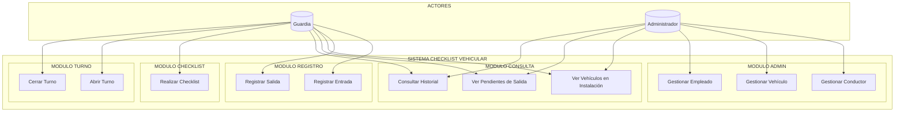
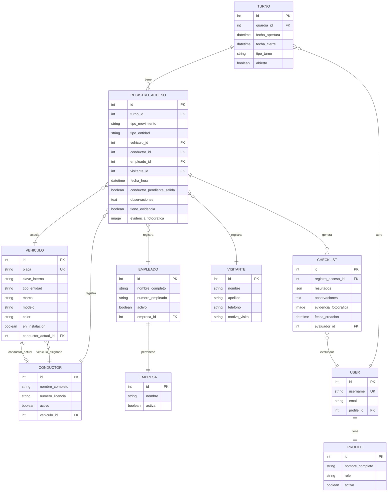
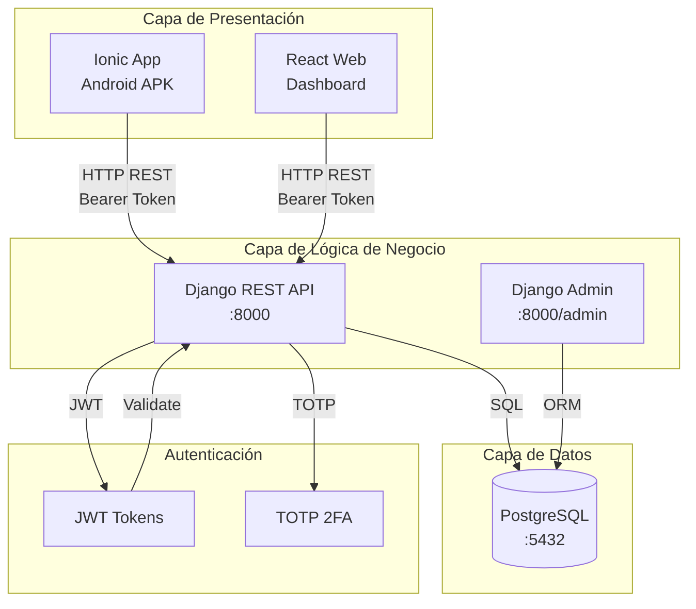

# CAPÍTULO III: ANÁLISIS Y DISEÑO

---

## 3.1 Análisis de Requerimientos

### 3.1.1 Requerimientos Funcionales

| ID | Requerimiento | Descripción | Prioridad |
|----|---------------|-------------|-----------|
| RF-01 | Registrar entrada tractocamión | Permitir registro de entrada de vehículos tractocamión con conductor asignado | Alta |
| RF-02 | Registrar salida tractocamión | Permitir registro de salida de tractocamiones, validando conductor actual | Alta |
| RF-03 | Registrar entrada conductor | Permitir registro de entrada de conductores sin vehículo | Alta |
| RF-04 | Registrar salida conductor | Permitir registro de salida de conductores, validando entrada pendiente | Alta |
| RF-05 | Registrar entrada empleado | Permitir registro de entrada de empleados de empresa con vehículo | Alta |
| RF-06 | Registrar salida empleado | Permitir registro de salida de empleados, validando vehículo | Alta |
| RF-07 | Registrar entrada visitante | Permitir registro de entrada de visitantes con captura de evidencia | Alta |
| RF-08 | Registrar salida visitante | Permitir registro de salida de visitantes | Alta |
| RF-09 | Realizar checklist vehicular | Permitir ejecución de checklist de inspección vehicular | Alta |
| RF-10 | Ver vehículos en instalación | Consultar lista de vehículos actualmente dentro | Alta |
| RF-11 | Ver pendientes de salida | Consultar lista de entidades pendientes de registrar salida | Alta |
| RF-12 | Consultar historial | Consultar historial de movimientos por fecha, tipo, entidad | Media |
| RF-13 | Abrir turno | Permitir al guardia abrir un turno de trabajo | Alta |
| RF-14 | Cerrar turno | Permitir al guardia cerrar su turno, finalizando jornada | Alta |
| RF-15 | Generar reportes PDF | Generar reportes de bitácora en formato PDF | Media |
| RF-16 | Gestionar conductores | CRUD de conductores (solo admin) | Baja |
| RF-17 | Gestionar vehículos | CRUD de vehículos (solo admin) | Baja |
| RF-18 | Gestionar empleados | CRUD de empleados (solo admin) | Baja |
| RF-19 | Autenticación JWT | Iniciar sesión con usuario y contraseña | Alta |
| RF-20 | Autenticación 2FA | Validar código TOTP después de contraseña | Alta |

---

### 3.1.2 Requerimientos No Funcionales

| ID | Categoría | Requerimiento | Métrica |
|----|-----------|---------------|---------|
| RNF-01 | Rendimiento | Tiempo de respuesta API | < 2 segundos |
| RNF-02 | Rendimiento | Tiempo de carga app móvil | < 3 segundos |
| RNF-03 | Disponibilidad | Uptime del sistema | 99% |
| RNF-04 | Seguridad | Cumplimiento OWASP Top 10 | 100% |
| RNF-05 | Seguridad | Contraseñas hashadas | PBKDF2-SHA256 |
| RNF-06 | Seguridad | Tokens JWT con expiración | 60 minutos |
| RNF-07 | Usabilidad | Interfaz intuitiva | < 5 minutos de aprendizaje |
| RNF-08 | Compatibilidad | Sistema operativo móvil | Android 8.0+ |
| RNF-09 | Compatibilidad | Navegadores web | Chrome, Firefox, Edge |
| RNF-10 | Escalabilidad | Usuarios concurrentes | 100+ |
| RNF-11 | Mantenibilidad | Código documentado | Docstrings en funciones |
| RNF-12 | Portabilidad | APK instalable | Sin necesidad de Play Store |

---

### 3.1.3 Requerimientos de Seguridad

| ID | Requerimiento | Implementación |
|----|---------------|----------------|
| RS-01 | Autenticación fuerte | JWT + 2FA obligatorio |
| RS-02 | Autorización granular | Permisos por rol (guardia, admin) |
| RS-03 | Protección CSRF | Tokens CSRF en formularios Django |
| RS-04 | Protección XSS | Escape de datos en templates |
| RS-05 | Protección SQL Injection | ORM Django (no SQL raw) |
| RS-06 | Headers de seguridad | CSP, X-Frame-Options, HSTS |
| RS-07 | Rate limiting | Máximo 5 intentos de login por minuto |
| RS-08 | Log de auditoría | Registro de todos los accesos |
| RS-09 | Contraseñas robustas | Mínimo 8 caracteres, alfanumérico |
| RS-10 | HTTPS obligatorio | TLS 1.2+ en producción |

---

## 3.2 Diagrama de Casos de Uso



---

## 3.3 Especificación de Casos de Uso

### CU-01: Registrar Entrada Tractocamión

| Campo | Descripción |
|-------|-------------|
| **Código** | CU-01 |
| **Nombre** | Registrar Entrada Tractocamión |
| **Actor** | Guardia |
| **Precondición** | Turno abierto, usuario autenticado |
| **Postcondición** | Registro creado, vehículo marcado como dentro |
| **Flujo principal** | 1. Seleccionar tipo "Tractocamión"<br>2. Ingresar/placa o buscar vehículo<br>3. Seleccionar conductor<br>4. Confirmar registro<br>5. Capturar evidencia fotográfica<br>6. ¿Realizar checklist? → Si → CU-06 |
| **Validaciones** | Vehículo no está dentro, conductor sin entrada pendiente |

### CU-02: Registrar Salida Tractocamión

| Campo | Descripción |
|-------|-------------|
| **Código** | CU-02 |
| **Nombre** | Registrar Salida Tractocamión |
| **Actor** | Guardia |
| **Precondición** | Vehículo dentro de la instalación |
| **Postcondición** | Registro creado, vehículo marcado como fuera |
| **Flujo principal** | 1. Seleccionar tipo "Tractocamión"<br>2. Seleccionar de lista de pendientes<br>3. Capturar evidencia fotográfica<br>4. Confirmar salida<br>5. ¿Realizar checklist? → Si → CU-06 |
| **Validaciones** | Vehículo está dentro, conductor es el actual |

### CU-06: Realizar Checklist

| Campo | Descripción |
|-------|-------------|
| **Código** | CU-06 |
| **Nombre** | Realizar Checklist Vehicular |
| **Actor** | Guardia |
| **Precondición** | Registro de acceso creado |
| **Postcondición** | Checklist guardado con evidencia |
| **Flujo principal** | 1. Seleccionar tipo de checklist<br>2. Marcar cada elemento como OK/NOK<br>3. Ingresar observaciones<br>4. Capturar fotos de evidencia<br>5. Guardar checklist |
| **Datos** | Lluvia de golpes, documentos, neumáticos, luces, espejos |

---

## 3.4 Modelo de Datos

### 3.4.1 Diagrama de Entidad-Relación



---

### 3.4.2 Diccionario de Datos

#### Tabla: Turno

| Campo | Tipo | Nulo | Descripción |
|-------|------|------|-------------|
| id | SERIAL | NO | Identificador único |
| guardia_id | INTEGER | NO | FK → auth_user.id |
| fecha_apertura | TIMESTAMP | NO | Fecha y hora de inicio |
| fecha_cierre | TIMESTAMP | SI | Fecha y hora de cierre |
| tipo_turno | VARCHAR(20) | NO | 'matutino', 'vespertino', 'nocturno' |
| abierto | BOOLEAN | NO | TRUE si está activo |
| created_at | TIMESTAMP | NO | Fecha de creación |
| updated_at | TIMESTAMP | NO | Fecha de última modificación |

#### Tabla: RegistroAcceso

| Campo | Tipo | Nulo | Descripción |
|-------|------|------|-------------|
| id | SERIAL | NO | Identificador único |
| turno_id | INTEGER | NO | FK → turno.id |
| tipo_movimiento | VARCHAR(20) | NO | 'entrada', 'salida' |
| tipo_entidad | VARCHAR(30) | NO | 'tracto', 'conductor', 'empleado', 'visitante', 'empleado_propio' |
| vehiculo_id | INTEGER | SI | FK → vehiculo.id (nullable) |
| conductor_id | INTEGER | SI | FK → conductor.id (nullable) |
| empleado_id | INTEGER | SI | FK → empleado.id (nullable) |
| visitante_id | INTEGER | SI | FK → visitante.id (nullable) |
| fecha_hora | TIMESTAMP | NO | Fecha y hora del movimiento |
| conductor_pendiente_salida | BOOLEAN | NO | TRUE si conductor no ha salido |
| observaciones | TEXT | SI | Observaciones del guardia |
| tiene_evidencia | BOOLEAN | NO | TRUE si hay foto |
| evidencia_fotografica | VARCHAR(255) | SI | Ruta de la imagen |
| created_at | TIMESTAMP | NO | Fecha de creación |

#### Tabla: Vehiculo

| Campo | Tipo | Nulo | Descripción |
|-------|------|------|-------------|
| id | SERIAL | NO | Identificador único |
| placa | VARCHAR(20) | NO | Placa vehicular (único) |
| clave_interna | VARCHAR(50) | SI | Código interno LRA |
| tipo_entidad | VARCHAR(30) | NO | 'tracto', 'automovil' |
| marca | VARCHAR(100) | SI | Marca del vehículo |
| modelo | VARCHAR(100) | SI | Modelo del vehículo |
| color | VARCHAR(50) | SI | Color de la unidad |
| en_instalacion | BOOLEAN | NO | TRUE si está dentro |
| conductor_actual_id | INTEGER | SI | FK → conductor.id |
| created_at | TIMESTAMP | NO | Fecha de creación |
| updated_at | TIMESTAMP | NO | Fecha de última modificación |

#### Tabla: Conductor

| Campo | Tipo | Nulo | Descripción |
|-------|------|------|-------------|
| id | SERIAL | NO | Identificador único |
| nombre_completo | VARCHAR(255) | NO | Nombre del conductor |
| numero_licencia | VARCHAR(50) | NO | Número de licencia |
| activo | BOOLEAN | NO | TRUE si está activo |
| vehiculo_id | INTEGER | SI | FK → vehiculo.id (opcional) |
| created_at | TIMESTAMP | NO | Fecha de creación |
| updated_at | TIMESTAMP | NO | Fecha de última modificación |

#### Tabla: Checklist

| Campo | Tipo | Nulo | Descripción |
|-------|------|------|-------------|
| id | SERIAL | NO | Identificador único |
| registro_acceso_id | INTEGER | NO | FK → registro_acceso.id |
| resultados | JSONB | NO | Elementos del checklist |
| observaciones | TEXT | SI | Observaciones adicionales |
| evidencia_fotografica | VARCHAR(255) | SI | Ruta de la imagen |
| fecha_creacion | TIMESTAMP | NO | Fecha y hora de creación |
| evaluador_id | INTEGER | NO | FK → auth_user.id |
| created_at | TIMESTAMP | NO | Fecha de creación |
| updated_at | TIMESTAMP | NO | Fecha de última modificación |

---

### 3.4.3 Script SQL de Creación

```sql
-- ============================================
-- SCRIPT SQL: CHECKLIST VEHICULAR
-- Creación de tablas para PostgreSQL
-- ============================================

-- Tabla: Turno
CREATE TABLE IF NOT EXISTS turno (
    id SERIAL PRIMARY KEY,
    guardia_id INTEGER NOT NULL REFERENCES auth_user(id),
    fecha_apertura TIMESTAMP NOT NULL DEFAULT CURRENT_TIMESTAMP,
    fecha_cierre TIMESTAMP NULL,
    tipo_turno VARCHAR(20) NOT NULL CHECK (tipo_turno IN ('matutino', 'vespertino', 'nocturno')),
    abierto BOOLEAN NOT NULL DEFAULT TRUE,
    created_at TIMESTAMP DEFAULT CURRENT_TIMESTAMP,
    updated_at TIMESTAMP DEFAULT CURRENT_TIMESTAMP
);

-- Tabla: Vehiculo
CREATE TABLE IF NOT EXISTS vehiculo (
    id SERIAL PRIMARY KEY,
    placa VARCHAR(20) UNIQUE NOT NULL,
    clave_interna VARCHAR(50),
    tipo_entidad VARCHAR(30) NOT NULL,
    marca VARCHAR(100),
    modelo VARCHAR(100),
    color VARCHAR(50),
    en_instalacion BOOLEAN NOT NULL DEFAULT FALSE,
    conductor_actual_id INTEGER REFERENCES conductor(id),
    created_at TIMESTAMP DEFAULT CURRENT_TIMESTAMP,
    updated_at TIMESTAMP DEFAULT CURRENT_TIMESTAMP
);

-- Tabla: Conductor
CREATE TABLE IF NOT EXISTS conductor (
    id SERIAL PRIMARY KEY,
    nombre_completo VARCHAR(255) NOT NULL,
    numero_licencia VARCHAR(50) NOT NULL,
    activo BOOLEAN NOT NULL DEFAULT TRUE,
    vehiculo_id INTEGER REFERENCES vehiculo(id),
    created_at TIMESTAMP DEFAULT CURRENT_TIMESTAMP,
    updated_at TIMESTAMP DEFAULT CURRENT_TIMESTAMP
);

-- Tabla: Empleado
CREATE TABLE IF NOT EXISTS empleado (
    id SERIAL PRIMARY KEY,
    nombre_completo VARCHAR(255) NOT NULL,
    numero_empleado VARCHAR(50) NOT NULL,
    activo BOOLEAN NOT NULL DEFAULT TRUE,
    empresa_id INTEGER REFERENCES empresa(id),
    created_at TIMESTAMP DEFAULT CURRENT_TIMESTAMP,
    updated_at TIMESTAMP DEFAULT CURRENT_TIMESTAMP
);

-- Tabla: Empresa
CREATE TABLE IF NOT EXISTS empresa (
    id SERIAL PRIMARY KEY,
    nombre VARCHAR(255) NOT NULL,
    activa BOOLEAN NOT NULL DEFAULT TRUE,
    created_at TIMESTAMP DEFAULT CURRENT_TIMESTAMP,
    updated_at TIMESTAMP DEFAULT CURRENT_TIMESTAMP
);

-- Tabla: Visitante
CREATE TABLE IF NOT EXISTS visitante (
    id SERIAL PRIMARY KEY,
    nombre VARCHAR(255) NOT NULL,
    apellido VARCHAR(255) NOT NULL,
    telefono VARCHAR(20),
    motivo_visita TEXT,
    created_at TIMESTAMP DEFAULT CURRENT_TIMESTAMP,
    updated_at TIMESTAMP DEFAULT CURRENT_TIMESTAMP
);

-- Tabla: RegistroAcceso
CREATE TABLE IF NOT EXISTS registro_acceso (
    id SERIAL PRIMARY KEY,
    turno_id INTEGER NOT NULL REFERENCES turno(id),
    tipo_movimiento VARCHAR(20) NOT NULL CHECK (tipo_movimiento IN ('entrada', 'salida')),
    tipo_entidad VARCHAR(30) NOT NULL,
    vehiculo_id INTEGER REFERENCES vehiculo(id),
    conductor_id INTEGER REFERENCES conductor(id),
    empleado_id INTEGER REFERENCES empleado(id),
    visitante_id INTEGER REFERENCES visitante(id),
    fecha_hora TIMESTAMP NOT NULL DEFAULT CURRENT_TIMESTAMP,
    conductor_pendiente_salida BOOLEAN NOT NULL DEFAULT FALSE,
    observaciones TEXT,
    tiene_evidencia BOOLEAN NOT NULL DEFAULT FALSE,
    evidencia_fotografica VARCHAR(255),
    created_at TIMESTAMP DEFAULT CURRENT_TIMESTAMP,
    updated_at TIMESTAMP DEFAULT CURRENT_TIMESTAMP
);

-- Tabla: Checklist
CREATE TABLE IF NOT EXISTS checklist (
    id SERIAL PRIMARY KEY,
    registro_acceso_id INTEGER NOT NULL REFERENCES registro_acceso(id),
    resultados JSONB NOT NULL,
    observaciones TEXT,
    evidencia_fotografica VARCHAR(255),
    fecha_creacion TIMESTAMP NOT NULL DEFAULT CURRENT_TIMESTAMP,
    evaluador_id INTEGER NOT NULL REFERENCES auth_user(id),
    created_at TIMESTAMP DEFAULT CURRENT_TIMESTAMP,
    updated_at TIMESTAMP DEFAULT CURRENT_TIMESTAMP
);

-- Índices para optimización
CREATE INDEX IF NOT EXISTS idx_turno_guardia ON turno(guardia_id);
CREATE INDEX IF NOT EXISTS idx_turno_abierto ON turno(abierto) WHERE abierto = TRUE;
CREATE INDEX IF NOT EXISTS idx_registro_acceso_fecha ON registro_acceso(fecha_hora DESC);
CREATE INDEX IF NOT EXISTS idx_registro_acceso_tipo ON registro_acceso(tipo_entidad, tipo_movimiento);
CREATE INDEX IF NOT EXISTS idx_vehiculo_en_instalacion ON vehiculo(en_instalacion) WHERE en_instalacion = TRUE;
```

---

## 3.5 Arquitectura del Sistema



**Capas de la Arquitectura:**

| Capa | Componente | Responsabilidad |
|------|------------|-----------------|
| Presentación | App Ionic, Web React | Interfaz de usuario, captura de datos |
| Lógica | Django REST API | Procesamiento de solicitudes, validación, reglas de negocio |
| Datos | PostgreSQL | Almacenamiento persistente, relaciones |
| Seguridad | JWT, TOTP | Autenticación, autorización |

---

## 3.6 Diseño de Interfaces

### Wireframe: Pantalla de Login

```
┌─────────────────────────────┐
│         CHECKLIST           │
│         VEHICULAR           │
│                             │
│  ┌───────────────────────┐  │
│  │   [Logo LRA]         │  │
│  └───────────────────────┘  │
│                             │
│  Usuario: [____________]    │
│  Contraseña: [____________]  │
│                             │
│  [    INICIAR SESIÓN    ]   │
│                             │
│  ¿Olvidaste tu contraseña?  │
└─────────────────────────────┘
```

### Wireframe: Quick Registro

```
┌─────────────────────────────┐
│ ← Regresar     REGISTRO      │
├─────────────────────────────┤
│                             │
│  TIPO DE ENTIDAD:           │
│  ┌─────┐ ┌─────┐ ┌─────┐   │
│  │Tracto│ │Cond.│ │Empl.│   │
│  └─────┘ └─────┘ └─────┘   │
│  ┌─────┐ ┌─────┐            │
│  │Visit│ │E.P. │            │
│  └─────┘ └─────┘            │
│                             │
│  Vehículo: [____________]   │
│  Conductor: [____________]   │
│                             │
│  [   CAPTURAR FOTO    ]     │
│                             │
│  [  CONFIRMAR ENTRADA  ]    │
│                             │
└─────────────────────────────┘
```

### Wireframe: Dashboard

```
┌─────────────────────────────┐
│  Menú           Dashboard    │
├─────────────────────────────┤
│                             │
│  Turno: Matutino (Abierto)  │
│  Guardia: Juan Pérez        │
│                             │
│  ┌─────────┐ ┌─────────┐    │
│  │  12    │ │   5     │    │
│  │Entradas│ │Salidas  │    │
│  └─────────┘ └─────────┘    │
│                             │
│  VEHÍCULOS DENTRO:          │
│  ┌─────────────────────┐    │
│  │ TRA-001 | Kenworth   │    │
│  │ TRA-002 | Peterbilt  │    │
│  │ EMP-001 | Nissan     │    │
│  └─────────────────────┘    │
│                             │
│  [Quick Registro]           │
│  [Checklist]                │
│  [Ver Todos]                │
│                             │
└─────────────────────────────┘
```

---

*Fin del Capítulo III: Análisis y Diseño*