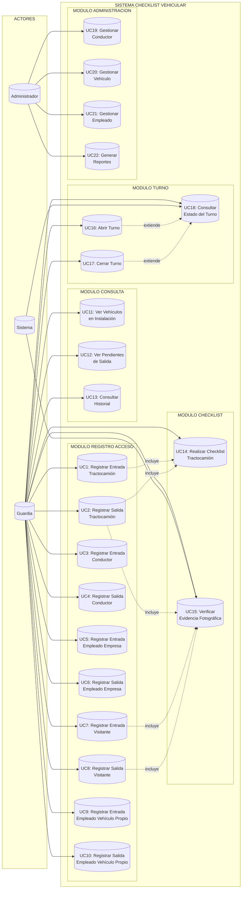
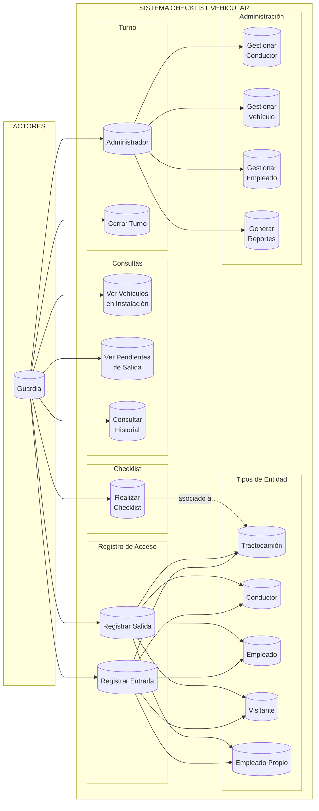
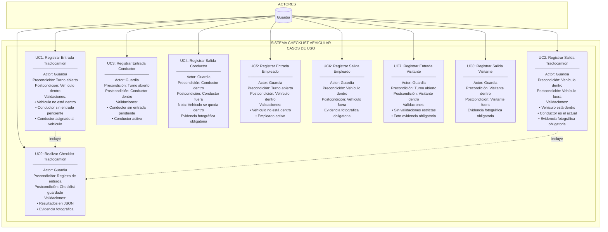

# Diagrama de Casos de Uso - Sistema Checklist Vehicular

## Versión Completa

```mermaid
flowchart LR
    subgraph "SISTEMA CHECKLIST VEHICULAR"
        subgraph "MODULO REGISTRO ACCESO"
            UC1[("UC1: Registrar Entrada<br/>Tractocamión")]
            UC2[("UC2: Registrar Salida<br/>Tractocamión")]
            UC3[("UC3: Registrar Entrada<br/>Conductor")]
            UC4[("UC4: Registrar Salida<br/>Conductor")]
            UC5[("UC5: Registrar Entrada<br/>Empleado Empresa")]
            UC6[("UC6: Registrar Salida<br/>Empleado Empresa")]
            UC7[("UC7: Registrar Entrada<br/>Visitante")]
            UC8[("UC8: Registrar Salida<br/>Visitante")]
            UC9[("UC9: Registrar Entrada<br/>Empleado Vehículo Propio")]
            UC10[("UC10: Registrar Salida<br/>Empleado Vehículo Propio")]
        end

        subgraph "MODULO CONSULTA"
            UC11[("UC11: Ver Vehículos<br/>en Instalación")]
            UC12[("UC12: Ver Pendientes<br/>de Salida")]
            UC13[("UC13: Consultar<br/>Historial")]
        end

        subgraph "MODULO CHECKLIST"
            UC14[("UC14: Realizar Checklist<br/>Tractocamión")]
            UC15[("UC15: Verificar<br/>Evidencia Fotográfica")]
        end

        subgraph "MODULO TURNO"
            UC16[("UC16: Abrir Turno")]
            UC17[("UC17: Cerrar Turno")]
            UC18[("UC18: Consultar<br/>Estado del Turno")]
        end

        subgraph "MODULO ADMINISTRACION"
            UC19[("UC19: Gestionar<br/>Conductor")]
            UC20[("UC20: Gestionar<br/>Vehículo")]
            UC21[("UC21: Gestionar<br/>Empleado")]
            UC22[("UC22: Generar<br/>Reportes")]
        end
    end

    subgraph "ACTORES"
        G[("Guardia")]
        A[("Administrador")]
        S[("Sistema")]
    end

    %% Actor Guardia - Casos de Uso
    G --> UC1
    G --> UC2
    G --> UC3
    G --> UC4
    G --> UC5
    G --> UC6
    G --> UC7
    G --> UC8
    G --> UC9
    G --> UC10
    G --> UC11
    G --> UC12
    G --> UC13
    G --> UC14
    G --> UC15
    G --> UC16
    G --> UC17
    G --> UC18

    %% Actor Administrador
    A --> UC19
    A --> UC20
    A --> UC21
    A --> UC22

    %% Sistema
    S --> UC15
    S --> UC18

    %% Relaciones entre UC
    UC1 -.->|"incluye"| UC14
    UC2 -.->|"incluye"| UC14
    UC2 -.->|"incluye"| UC15
    UC7 -.->|"incluye"| UC15
    UC8 -.->|"incluye"| UC15
    UC16 -.->|"extiende"| UC18
    UC17 -.->|"extiende"| UC18
```

---

## Versión Simplificada (Recomendada)

```mermaid
flowchart LR
    subgraph "SISTEMA CHECKLIST VEHICULAR"
        subgraph "Registro de Acceso"
            E1[("Registrar Entrada")]
            S1[("Registrar Salida")]
        end

        subgraph "Tipos de Entidad"
            T1[("Tractocamión")]
            T2[("Conductor")]
            T3[("Empleado")]
            T4[("Visitante")]
            T5[("Empleado Propio")]
        end

        subgraph "Consultas"
            C1[("Ver Vehículos<br/>en Instalación")]
            C2[("Ver Pendientes<br/>de Salida")]
            C3[("Consultar<br/>Historial")]
        end

        subgraph "Checklist"
            CH[("Realizar<br/>Checklist")]
        end

        subgraph "Turno"
            A[("Abrir Turno")]
            C[("Cerrar Turno")]
        end

        subgraph "Administración"
            G1[("Gestionar<br/>Conductor")]
            G2[("Gestionar<br/>Vehículo")]
            G3[("Gestionar<br/>Empleado")]
            R[("Generar<br/>Reportes")]
        end
    end

    subgraph "ACTORES"
        G[("Guardia")]
        A[("Administrador")]
    end

    G --> E1
    G --> S1
    G --> C1
    G --> C2
    G --> C3
    G --> CH
    G --> A
    G --> C

    A --> G1
    A --> G2
    A --> G3
    A --> R

    E1 --> T1
    E1 --> T2
    E1 --> T3
    E1 --> T4
    E1 --> T5

    S1 --> T1
    S1 --> T2
    S1 --> T3
    S1 --> T4
    S1 --> T5

    CH -.->|"asociado a"| T1
```

---

## Versión Detallada con Descripciones

```mermaid
flowchart TB
    subgraph "SISTEMA CHECKLIST VEHICULAR"
        subgraph "CASOS DE USO"
            UC1["UC1: Registrar Entrada Tractocamión<br/>─────────────────<br/>Actor: Guardia<br/>Precondición: Turno abierto<br/>Postcondición: Vehículo dentro<br/>Validaciones:<br/>• Vehículo no está dentro<br/>• Conductor sin entrada pendiente<br/>• Conductor asignado al vehículo"]

            UC2["UC2: Registrar Salida Tractocamión<br/>─────────────────<br/>Actor: Guardia<br/>Precondición: Vehículo dentro<br/>Postcondición: Vehículo fuera<br/>Validaciones:<br/>• Vehículo está dentro<br/>• Conductor es el actual<br/>• Evidencia fotográfica obligatoria"]

            UC3["UC3: Registrar Entrada Conductor<br/>─────────────────<br/>Actor: Guardia<br/>Precondición: Turno abierto<br/>Postcondición: Conductor dentro<br/>Validaciones:<br/>• Conductor sin entrada pendiente<br/>• Conductor activo"]

            UC4["UC4: Registrar Salida Conductor<br/>─────────────────<br/>Actor: Guardia<br/>Precondición: Conductor dentro<br/>Postcondición: Conductor fuera<br/>Nota: Vehículo se queda dentro<br/>Evidencia fotográfica obligatoria"]

            UC5["UC5: Registrar Entrada Empleado<br/>─────────────────<br/>Actor: Guardia<br/>Precondición: Turno abierto<br/>Postcondición: Vehículo dentro<br/>Validaciones:<br/>• Vehículo no está dentro<br/>• Empleado activo"]

            UC6["UC6: Registrar Salida Empleado<br/>─────────────────<br/>Actor: Guardia<br/>Precondición: Vehículo dentro<br/>Postcondición: Vehículo fuera<br/>Evidencia fotográfica obligatoria"]

            UC7["UC7: Registrar Entrada Visitante<br/>─────────────────<br/>Actor: Guardia<br/>Precondición: Turno abierto<br/>Postcondición: Visitante dentro<br/>Validaciones:<br/>• Sin validaciones estrictas<br/>• Foto evidencia obligatoria"]

            UC8["UC8: Registrar Salida Visitante<br/>─────────────────<br/>Actor: Guardia<br/>Precondición: Visitante dentro<br/>Postcondición: Visitante fuera<br/>Evidencia fotográfica obligatoria"]

            UC9["UC9: Realizar Checklist Tractocamión<br/>─────────────────<br/>Actor: Guardia<br/>Precondición: Registro de entrada<br/>Postcondición: Checklist guardado<br/>Validaciones:<br/>• Resultados en JSON<br/>• Evidencia fotográfica"]
        end
    end

    subgraph "ACTORES"
        G[("Guardia")]
    end

    G --> UC1
    G --> UC2
    G --> UC3
    G --> UC4
    G --> UC5
    G --> UC6
    G --> UC7
    G --> UC8
    G --> UC9

    UC1 -.->|"incluye"| UC9
    UC2 -.->|"incluye"| UC9
```
