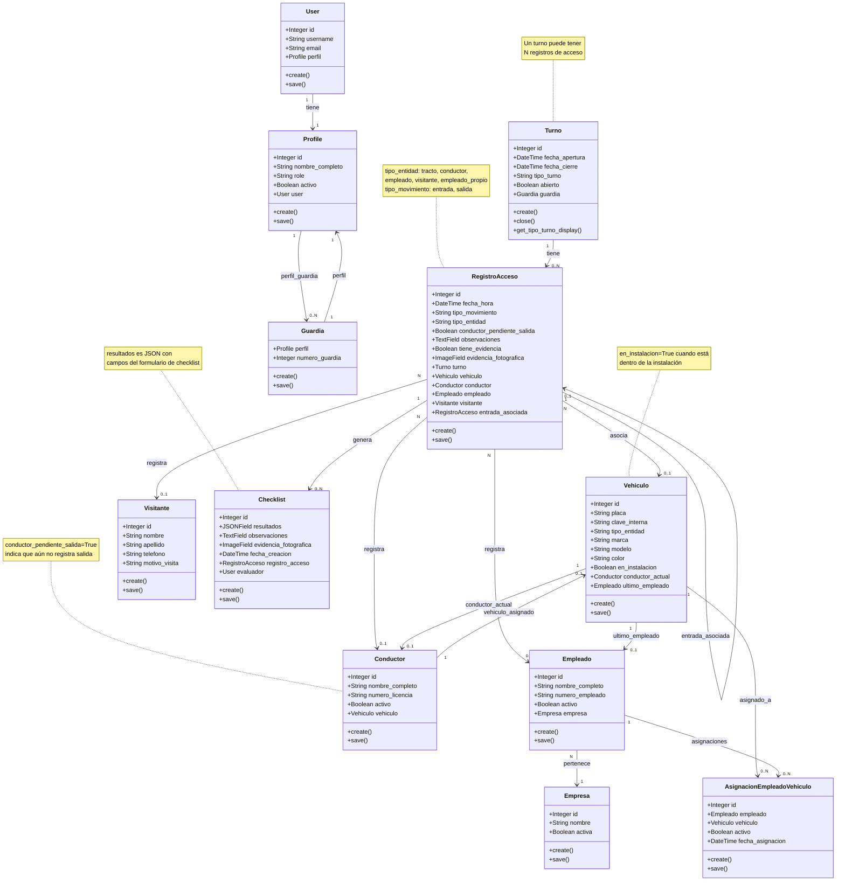
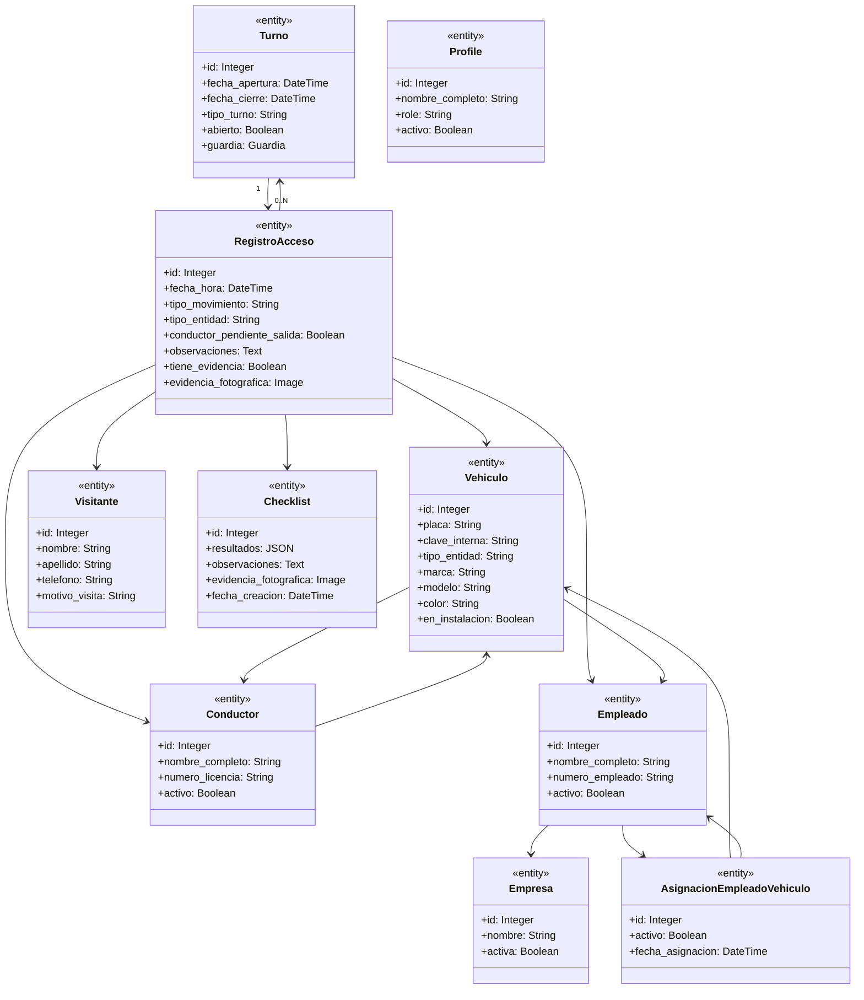

# Diagrama de Clases UML - Sistema Checklist Vehicular

```mermaid
classDiagram
    class Turno {
        +Integer id
        +DateTime fecha_apertura
        +DateTime fecha_cierre
        +String tipo_turno
        +Boolean abierto
        +Guardia guardia
        +create()
        +close()
        +get_tipo_turno_display()
    }

    class RegistroAcceso {
        +Integer id
        +DateTime fecha_hora
        +String tipo_movimiento
        +String tipo_entidad
        +Boolean conductor_pendiente_salida
        +TextField observaciones
        +Boolean tiene_evidencia
        +ImageField evidencia_fotografica
        +Turno turno
        +Vehiculo vehiculo
        +Conductor conductor
        +Empleado empleado
        +Visitante visitante
        +RegistroAcceso entrada_asociada
        +create()
        +save()
    }

    class Vehiculo {
        +Integer id
        +String placa
        +String clave_interna
        +String tipo_entidad
        +String marca
        +String modelo
        +String color
        +Boolean en_instalacion
        +Conductor conductor_actual
        +Empleado ultimo_empleado
        +create()
        +save()
    }

    class Conductor {
        +Integer id
        +String nombre_completo
        +String numero_licencia
        +Boolean activo
        +Vehiculo vehiculo
        +create()
        +save()
    }

    class Empleado {
        +Integer id
        +String nombre_completo
        +String numero_empleado
        +Boolean activo
        +Empresa empresa
        +create()
        +save()
    }

    class Empresa {
        +Integer id
        +String nombre
        +Boolean activa
        +create()
        +save()
    }

    class Visitante {
        +Integer id
        +String nombre
        +String apellido
        +String telefono
        +String motivo_visita
        +create()
        +save()
    }

    class AsignacionEmpleadoVehiculo {
        +Integer id
        +Empleado empleado
        +Vehiculo vehiculo
        +Boolean activo
        +DateTime fecha_asignacion
        +create()
        +save()
    }

    class Checklist {
        +Integer id
        +JSONField resultados
        +TextField observaciones
        +ImageField evidencia_fotografica
        +DateTime fecha_creacion
        +RegistroAcceso registro_acceso
        +User evaluador
        +create()
        +save()
    }

    class User {
        +Integer id
        +String username
        +String email
        +Profile perfil
        +create()
        +save()
    }

    class Profile {
        +Integer id
        +String nombre_completo
        +String role
        +Boolean activo
        +User user
        +create()
        +save()
    }

    class Guardia {
        +Profile perfil
        +Integer numero_guardia
        +create()
        +save()
    }

    %% RELACIONES
    Turno "1" --> "0..N" RegistroAcceso : tiene
    RegistroAcceso "N" --> "0..1" Vehiculo : asocia
    RegistroAcceso "N" --> "0..1" Conductor : registra
    RegistroAcceso "N" --> "0..1" Empleado : registra
    RegistroAcceso "N" --> "0..1" Visitante : registra
    RegistroAcceso "1" --> "0..1" RegistroAcceso : entrada_asociada
    RegistroAcceso "1" --> "0..N" Checklist : genera

    Vehiculo "1" --> "0..1" Conductor : conductor_actual
    Vehiculo "1" --> "0..1" Empleado : ultimo_empleado
    Vehiculo "1" --> "0..N" AsignacionEmpleadoVehiculo : asignado_a

    Conductor "1" --> "0..1" Vehiculo : vehiculo_asignado

    Empleado "N" --> "1" Empresa : pertenece
    Empleado "1" --> "0..N" AsignacionEmpleadoVehiculo : asignaciones

    User "1" --> "1" Profile : tiene
    Profile "1" --> "0..N" Guardia : perfil_guardia

    Guardia "1" --> "1" Profile : perfil

    %% NOTAS
    note for Turno "Un turno puede tener<br/>N registros de acceso"
    note for RegistroAcceso "tipo_entidad: tracto, conductor,<br/>empleado, visitante, empleado_propio<br/>tipo_movimiento: entrada, salida"
    note for Vehiculo "en_instalacion=True cuando está<br/>dentro de la instalación"
    note for Conductor "conductor_pendiente_salida=True<br/>indica que aún no registra salida"
    note for Checklist "resultados es JSON con<br/>campos del formulario de checklist"
```

---

## Versión Simplificada (Más limpia)

```mermaid
classDiagram
    class Turno {
        <<entity>>
        +id: Integer
        +fecha_apertura: DateTime
        +fecha_cierre: DateTime
        +tipo_turno: String
        +abierto: Boolean
        +guardia: Guardia
    }

    class RegistroAcceso {
        <<entity>>
        +id: Integer
        +fecha_hora: DateTime
        +tipo_movimiento: String
        +tipo_entidad: String
        +conductor_pendiente_salida: Boolean
        +observaciones: Text
        +tiene_evidencia: Boolean
        +evidencia_fotografica: Image
    }

    class Vehiculo {
        <<entity>>
        +id: Integer
        +placa: String
        +clave_interna: String
        +tipo_entidad: String
        +marca: String
        +modelo: String
        +color: String
        +en_instalacion: Boolean
    }

    class Conductor {
        <<entity>>
        +id: Integer
        +nombre_completo: String
        +numero_licencia: String
        +activo: Boolean
    }

    class Empleado {
        <<entity>>
        +id: Integer
        +nombre_completo: String
        +numero_empleado: String
        +activo: Boolean
    }

    class Empresa {
        <<entity>>
        +id: Integer
        +nombre: String
        +activa: Boolean
    }

    class Visitante {
        <<entity>>
        +id: Integer
        +nombre: String
        +apellido: String
        +telefono: String
        +motivo_visita: String
    }

    class AsignacionEmpleadoVehiculo {
        <<entity>>
        +id: Integer
        +activo: Boolean
        +fecha_asignacion: DateTime
    }

    class Checklist {
        <<entity>>
        +id: Integer
        +resultados: JSON
        +observaciones: Text
        +evidencia_fotografica: Image
        +fecha_creacion: DateTime
    }

    class Profile {
        <<entity>>
        +id: Integer
        +nombre_completo: String
        +role: String
        +activo: Boolean
    }

    %% RELACIONES
    Turno "1" --> "0..N" RegistroAcceso
    RegistroAcceso --> Vehiculo
    RegistroAcceso --> Conductor
    RegistroAcceso --> Empleado
    RegistroAcceso --> Visitante
    RegistroAcceso --> Checklist
    RegistroAcceso --> Turno

    Vehiculo --> Conductor
    Vehiculo --> Empleado

    Conductor --> Vehiculo
    Empleado --> Empresa
    Empleado --> AsignacionEmpleadoVehiculo
    AsignacionEmpleadoVehiculo --> Vehiculo
    AsignacionEmpleadoVehiculo --> Empleado
```
