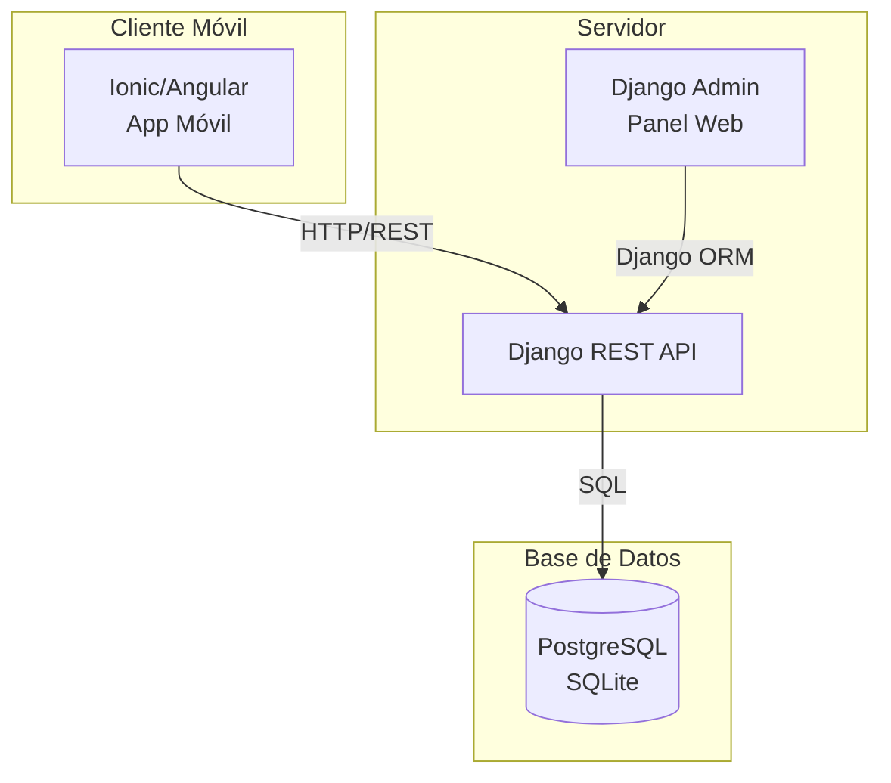
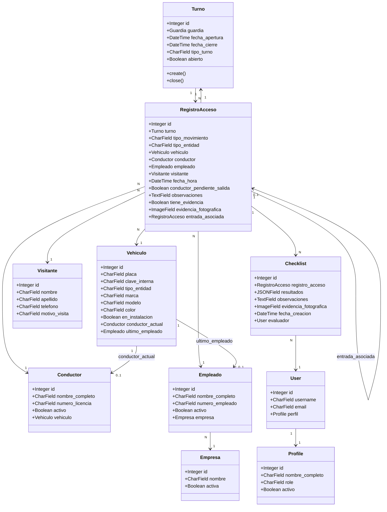
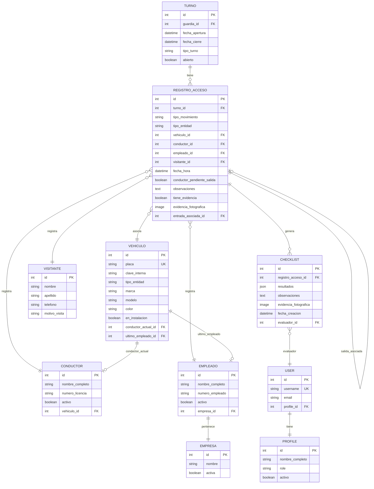
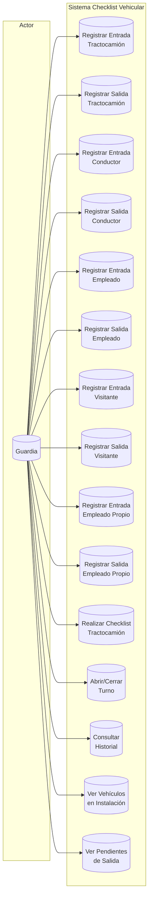
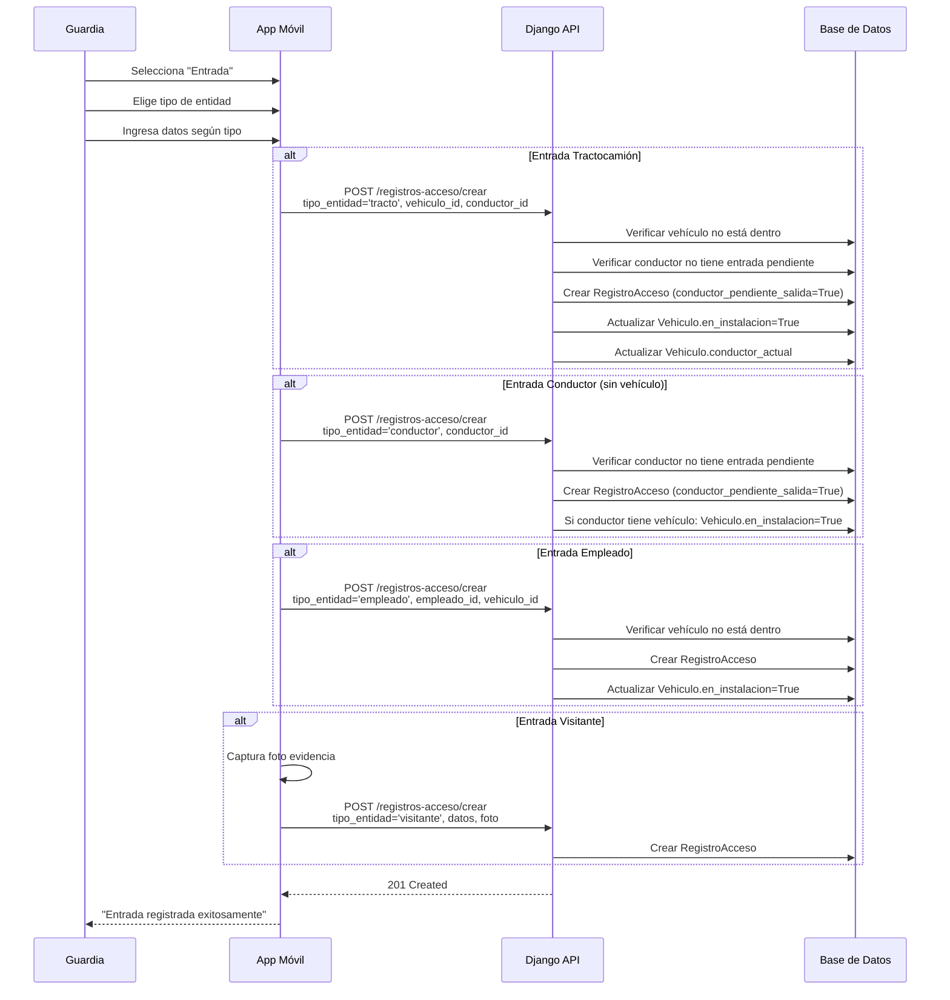
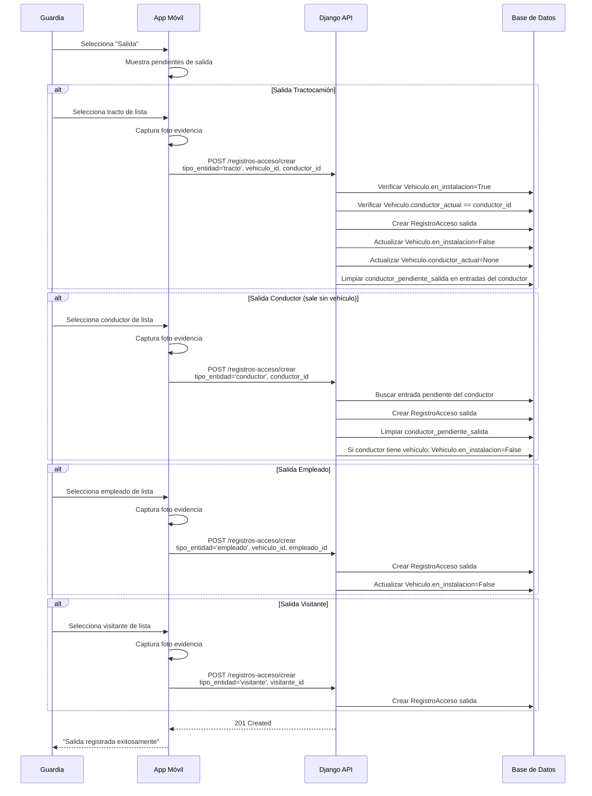
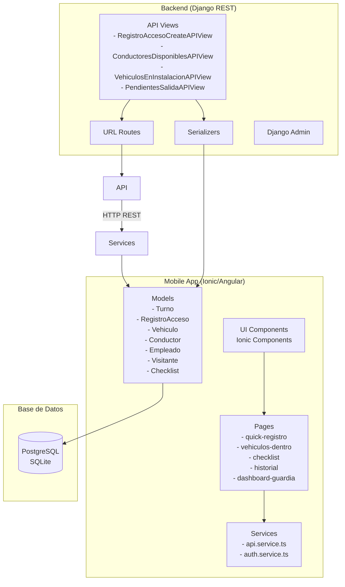
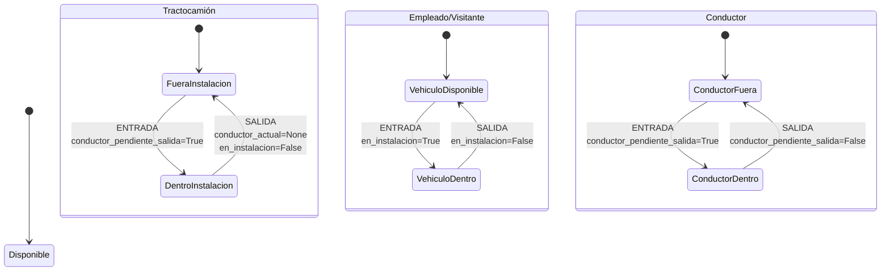
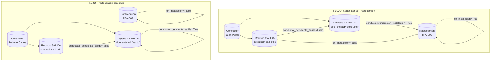

# Diagrama UML - Sistema Checklist Vehicular

## 1. Arquitectura General



---

## 2. Modelo de Dominio (Class Diagram)



---

## 3. Diagrama de Entidad-Relación (ER)



---

## 4. Casos de Uso (Use Case Diagram)



---

## 5. Flujo de Registrar Entrada



---

## 6. Flujo de Registrar Salida



---

## 7. Diagrama de Componentes



---

## 8. Diagrama de Estados - Vehículo



---

## 9. Tipos de Entidad y Movimientos

```mermaid
graph LR
    subgraph "tipo_entidad"
        T1["tracto"]
        T2["conductor"]
        T3["empleado"]
        T4["visitante"]
        T5["empleado_propio"]
    end

    subgraph "tipo_movimiento"
        M1["entrada"]
        M2["salida"]
    end

    subgraph "Validaciones"
        V1["conductor_pendiente_salida"]
        V2["en_instalacion"]
    end

    T1 --> M1 : Crea registro<br/>conductor_pendiente_salida=True
    T1 --> M2 : Requiere evidencia<br/>Actualiza Vehiculo
    T2 --> M1 : Crea registro<br/>conductor_pendiente_salida=True
    T2 --> M2 : Requiere evidencia<br/>Limpia pendientes
    T3 --> M1 : Requiere vehiculo<br/>en_instalacion=True
    T3 --> M2 : Requiere evidencia<br/>en_instalacion=False
    T4 --> M1 : Sin validaciones<br/>conductor_pendiente_salida=True
    T4 --> M2 : Requiere evidencia
    T5 --> M1 : Crea registro<br/>conductor_pendiente_salida=True
    T5 --> M2 : Requiere evidencia
```

---

## 10. Relación Conductor - Vehículo



---

## 11. endpoints API

```mermaid
graph LR
    subgraph "Endpoints Principales"
        E1["POST /api/platform/registros-acceso/crear/"]
        E2["GET /api/platform/registros-acceso/"]
        E3["GET /api/platform/registros-acceso/pendientes-salida/"]
        E4["GET /api/platform/conductores/disponibles/"]
        E5["GET /api/platform/conductores/"]
        E6["GET /api/platform/vehiculos/en-instalacion/"]
        E7["GET /api/platform/empleados/"]
        E8["GET /api/platform/asignaciones/empleados-con-vehiculo-disponible/"]
        E9["GET /api/platform/checklists/"]
        E10["POST /api/platform/checklists/crear/"]
        E11["GET /api/platform/turnos/"]
        E12["POST /api/platform/turnos/abrir/"]
        E13["POST /api/platform/turnos/cerrar/"]
    end
```



---

## 12. Notas de Implementación

### Campos clave en RegistroAcceso

| Campo | Descripción |
|-------|-------------|
| `tipo_entidad` | tracto, conductor, empleado, visitante, empleado_propio |
| `tipo_movimiento` | entrada, salida |
| `conductor_pendiente_salida` | Indica si el conductor aún no ha registrado salida |
| `en_instalacion` | En Vehiculo, indica si está dentro de la instalación |
| `conductor_actual` | En Vehiculo, referencia al conductor manejando |

### Reglas de Negocio

1. **Tractocamión**: Solo puede entrar/salir con su conductor asignado
2. **Conductor**: Puede entrar sin vehículo, pero debe registrar salida sin vehículo
3. **Empleado**: Puede dejar vehículo dentro si tiene fallas (registra salida sin vehículo)
4. **Visitante**: No tiene vehículo propio en el sistema
5. **conductor_pendiente_salida**: Se usa para filtrar pendientes de salida
