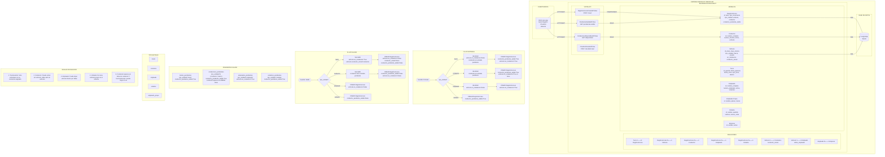

# Diagrama Unificado - Sistema Checklist Vehicular

```mermaid
flowchart TB
    subgraph "SISTEMA CHECKLIST VEHICULAR"
        subgraph "CLIENTE MÓVIL"
            A[":8100 Ionic App<br/>Quick Registro<br/>Checklist<br/>Historial"]
        end

        subgraph "BACKEND DJANGO REST"
            subgraph "VISTAS API"
                V1["RegistroAccesoCreateAPIView<br/>POST /crear/"]
                V2["ConductoresDisponiblesAPIView<br/>GET /disponibles/"]
                V3["PendientesSalidaAPIView<br/>GET /pendientes-salida/"]
                V4["ChecklistCreateAPIView<br/>POST checklist/crear/"]
            end

            subgraph "MODELOS"
                M_TURNO["Turno<br/>id, guardia, fecha_apertura<br/>fecha_cierre, tipo_turno, abierto"]
                M_REG["RegistroAcceso<br/>id, turno, tipo_movimiento<br/>tipo_entidad, vehiculo, conductor<br/>conductor_pendiente_salida"]
                M_VEH["Vehiculo<br/>id, placa, clave_interna<br/>tipo_entidad, marca, modelo<br/>en_instalacion, conductor_actual"]
                M_COND["Conductor<br/>id, nombre_completo<br/>numero_licencia, activo, vehiculo"]
                M_EMP["Empleado<br/>id, nombre_completo<br/>numero_empleado, activo, empresa"]
                M_EMP_VP["Empleado Propio<br/>id, nombre, placas, marca"]
                M_VIS["Visitante<br/>id, nombre, apellido<br/>telefono, motivo_visita"]
                M_EMP_EMPRESA["Empresa<br/>id, nombre, activa"]
            end

            subgraph "RELACIONES"
                R1["Turno 1───N RegistroAcceso"]
                R2["RegistroAcceso N───1 Vehiculo"]
                R3["RegistroAcceso N───1 Conductor"]
                R4["RegistroAcceso N───1 Empleado"]
                R5["RegistroAcceso N───1 Visitante"]
                R6["Vehiculo 1───1 Conductor<br/>conductor_actual"]
                R7["Vehiculo 1───1 Empleado<br/>ultimo_empleado"]
                R8["Empleado N───1 Empresa"]
            end
        end

        subgraph "BASE DE DATOS"
            DB[(PostgreSQL<br/>SQLite)]
        end
    end

    A -->|"HTTP REST"| V1
    A -->|"HTTP REST"| V2
    A -->|"HTTP REST"| V3
    V1 -->|"CREATE/READ"| M_REG
    V2 -->|"READ"| M_COND
    V3 -->|"READ"| M_REG
    M_REG -->|"SQL"| DB
    M_COND -->|"SQL"| DB
    M_VEH -->|"SQL"| DB

    subgraph "FLUJO ENTRADA"
        direction LR
        FE1{{"Guardia: Entrada"}} --> FE2{"tipo_entidad?"}
        FE2 -->|"tracto"| FE3["VALIDAR<br/>vehiculo.en_instalacion=False<br/>conductor.sin entrada pendiente"]
        FE3 --> FE4["CREAR RegistroAcceso<br/>conductor_pendiente_salida=True<br/>vehiculo.en_instalacion=True"]
        FE2 -->|"conductor"| FE5["VALIDAR<br/>conductor.sin entrada pendiente"]
        FE5 --> FE6["CREAR RegistroAcceso<br/>conductor_pendiente_salida=True<br/>vehiculo.en_instalacion=True si tiene"]
        FE2 -->|"empleado"| FE7["VALIDAR<br/>vehiculo.en_instalacion=False"]
        FE7 --> FE8["CREAR RegistroAcceso<br/>vehiculo.en_instalacion=True"]
        FE2 -->|"visitante"| FE9["CREAR RegistroAcceso<br/>conductor_pendiente_salida=True"]
    end

    subgraph "FLUJO SALIDA"
        direction LR
        FS1{{"Guardia: Salida"}} --> FS2{"tipo_entidad?"}
        FS2 -->|"tracto"| FS3["VALIDAR<br/>vehiculo.en_instalacion=True<br/>vehiculo.conductor_actual=conductor"]
        FS3 --> FS4["CREAR RegistroAcceso<br/>vehiculo.en_instalacion=False<br/>conductor_actual=None<br/>conductor_pendiente_salida=False"]
        FS2 -->|"conductor"| FS5["VALIDAR<br/>conductor tiene entrada pendiente"]
        FS5 --> FS6["CREAR RegistroAcceso<br/>conductor_pendiente_salida=False<br/>vehiculo.en_instalacion=False"]
        FS2 -->|"empleado"| FS7["CREAR RegistroAcceso<br/>vehiculo.en_instalacion=False"]
        FS2 -->|"visitante"| FS8["CREAR RegistroAcceso<br/>conductor_pendiente_salida=False"]
    end

    subgraph "PENDIENTES SALIDA"
        direction TB
        PS1["tractos_pendientes<br/>tipo_entidad='tracto'<br/>conductor_pendiente_salida=True"]
        PS2["conductores_pendientes<br/>tipo_entidad IN ('conductor','tracto')<br/>conductor_pendiente_salida=True<br/>conductor aparece en AMBAS listas"]
        PS3["empleados_pendientes<br/>tipo_entidad='empleado'<br/>vehiculo.en_instalacion=True"]
        PS4["visitantes_pendientes<br/>tipo_entidad='visitante'<br/>conductor_pendiente_salida=True"]
    end

    subgraph "TIPO ENTIDAD"
        direction LR
        TE1["tracto"]
        TE2["conductor"]
        TE3["empleado"]
        TE4["visitante"]
        TE5["empleado_propio"]
    end

    subgraph "REGLAS DE NEGOCIO"
        direction TB
        RB1["1. Tractocamión: Solo entra/sale con su conductor asignado"]
        RB2["2. Conductor: Puede entrar sin vehiculo, debe salir sin vehiculo"]
        RB3["3. Empleado: Puede dejar vehiculo dentro por fallas"]
        RB4["4. Visitante: No tiene vehiculo propio en el sistema"]
        RB5["5. Conductor aparece en listas de conductor Y tractocamiones cuando llegó con el"]
    end
```
